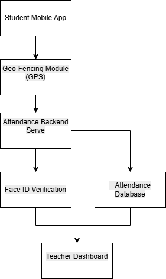

# Smart-Attend – SDLC Assignment

## Project Overview

Smart-Attend is a mobile application designed to automate student attendance using **Geo-Fencing technology**. When students enter the classroom area, their attendance is automatically recorded.

To prevent proxy attendance, the system integrates **Face ID biometric verification**.

This project analyzes how different SDLC models handle changing requirements and demonstrates the use of Agile Scrum for iterative development.

---

## SDLC Analysis

The project compares two development approaches:

### Waterfall Model

* Sequential development process
* Difficult to adapt to requirement changes
* High cost when new features are introduced mid-development

### Agile Scrum Framework

* Iterative development using short sprints
* Allows quick adaptation to changing requirements
* Continuous feedback and improvement

---

## Sprint Plan

### Sprint 1 – Minimum Viable Product

* Basic UI
* Student login
* Geo-fencing attendance detection
* Teacher dashboard
* Attendance notification

### Sprint 2 – Feature Update

* Face ID biometric verification
* Security improvements
* Reporting dashboard enhancements

---

## Sprint Backlog

The Sprint Backlog lists tasks planned for Sprint 1 including login functionality, geo-fencing detection, attendance notifications, and admin override features.

---

## System Architecture



The system includes:

* Student Mobile Application
* Geo-Fencing Detection Module
* Backend Attendance Server
* Face ID Verification
* Attendance Database
* Teacher Dashboard

---

## CI/CD Explanation

Continuous Integration and Continuous Deployment help automate the process of building, testing, and deploying updates.

Benefits include:

* Faster release cycles
* Automated testing
* Reliable deployment
* Quick delivery of sprint updates to users

---

## Repository Structure

```
SDLC-Assignment-Ansh
│
├── README.md
├── Waterfall-Analysis.pdf
├── Sprint-Backlog.xlsx
│
├── analysis
│   └── waterfall-agile-analysis.md
│
├── backlog
│   └── sprint-backlog.csv
│
└── docs
    ├── architecture.md
    └── smart-attend-architecture.png
```
